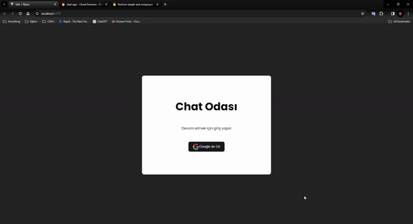

# Chat APP 
I created a chat app with React and Firebase. 

As seen in the design, I created a messaging application in which messages are saved in a database. I used Firebase for the database. 
Afterwards, I implemented the dynamics that allow the database to control entries and save messages and rooms.

## Screen

